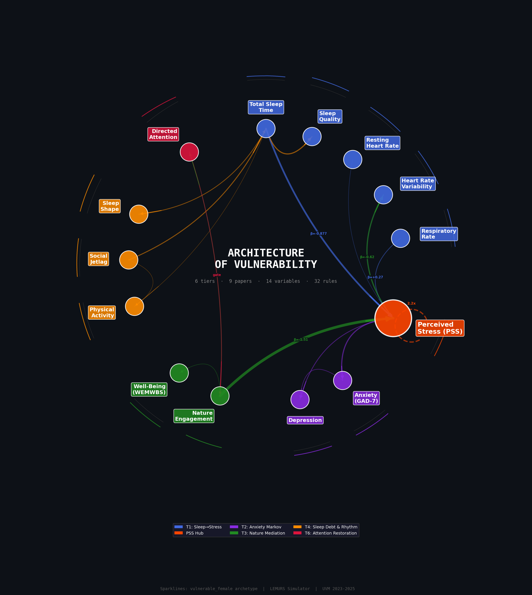
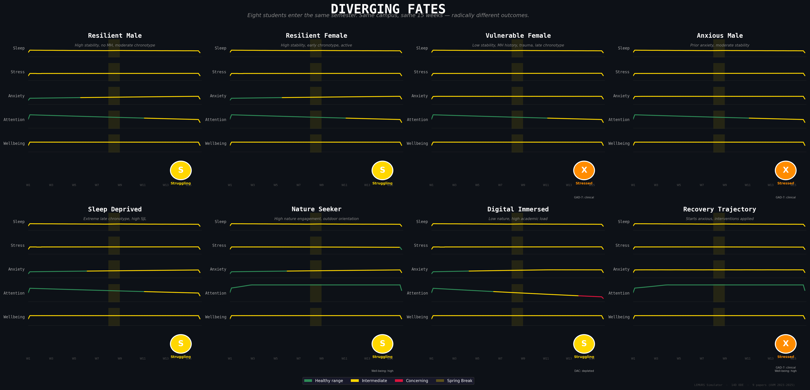
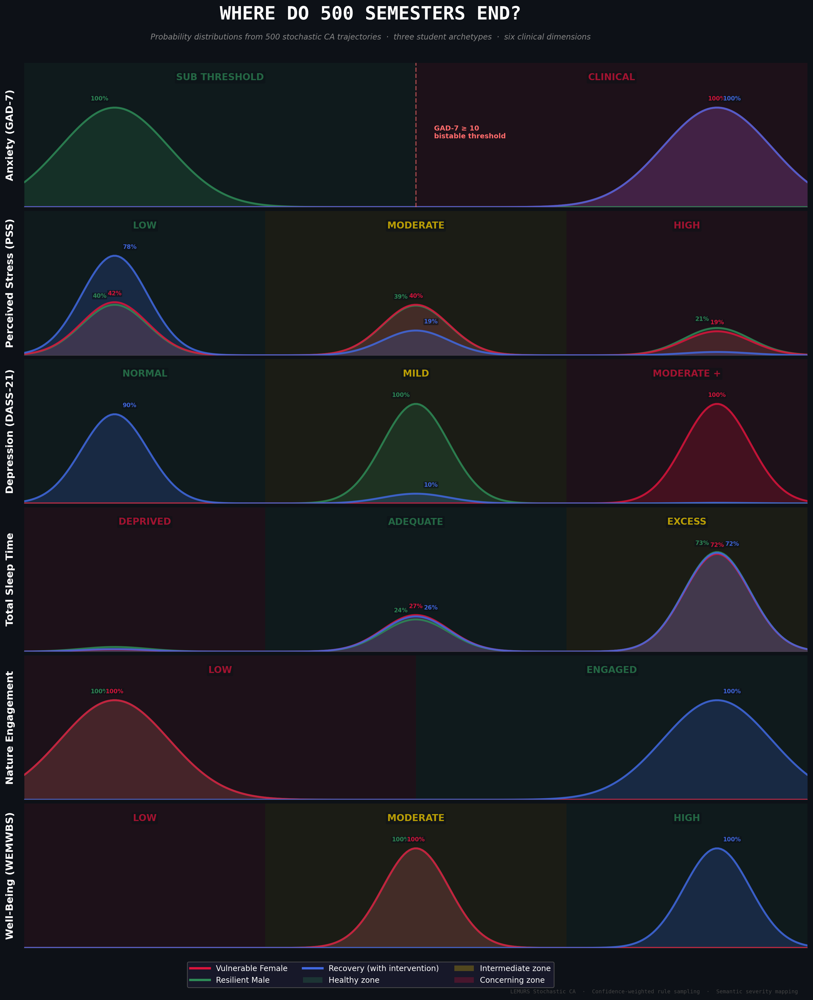

# LEMURS Semester Simulator

A 14-state ODE simulator modeling the coupled sleep-stress-anxiety-nature dynamical system of college students through a 15-week semester. Based on 9 published papers from the **LEMURS** research program (Lived Experiences Measured Using Rings Study) at the University of Vermont, 2023-2025.

The simulator tracks how sleep disruption, academic stress, nature engagement, and circadian misalignment interact to shape psychological and physiological outcomes -- day by day, from move-in to finals.

<p align="center">
  
</p>

**Architecture of Vulnerability.** The 14 state variables of the LEMURS dynamical system arranged radially by coupling tier. Perceived Stress (PSS, center hub, orange) is the convergence point: sleep biomarkers (blue, top) feed in through Tier 1 (TST→PSS, β = -0.877/hr), nature engagement (green, bottom) feeds in through Tier 3 (β = -1.507/unit), and anxiety (purple, right) feeds out through Tier 2 Markov dynamics. Ribbon thickness is proportional to empirical coupling strength. The PSS self-loop represents the 2.2x within-person amplification discovered in Paper 3 — a student's deviation from their *own* sleep baseline predicts stress more than twice as strongly as between-person differences. Sparklines on the outer rim trace the vulnerable_female archetype's semester trajectory. Six coupling tiers from 9 peer-reviewed papers compose into a system where local rules (sleep debt, anxiety thresholds, attention depletion) generate global phenomena: bistability, burnout traps, and the spring break phase transition.

## What This Models

A college semester is 105 days of coupled biopsychosocial dynamics. Sleep debt accumulates on weeknights. Stress ratchets up toward finals. Anxiety crosses and recrosses clinical thresholds. Directed attention drains under academic load and restores in green spaces. Spring break briefly removes all institutional forcing, revealing which students bounce back and which have accumulated too much damage.

The simulator captures six empirically grounded tiers of coupling:

| Tier | Coupling | Source |
|------|----------|--------|
| 1 | **Sleep -> Stress** | Wearable biomarkers (TST, RHR, HRV, ARR) predict perceived stress; within-person deviations 2.2x stronger than between-person differences | Paper 3 |
| 2 | **Anxiety Markov dynamics** | GAD-7 threshold at >= 10 creates bistable regime; development risk modified by emotional stability, MH history, trauma, academic load; recovery decays with hysteresis | Paper 4 |
| 3 | **Nature -> Stress -> HRV mediation** | Nature engagement reduces PSS (-1.507/unit), PSS reduction improves HRV; therapy independently reduces DASS stress and respiratory rate | Paper 7 |
| 4 | **Sleep debt & activity** | Weekday sleep debt (37-55 min/school night), weekend partial recovery; paradoxical activity compensation (less sleep = more active) | Paper 6 |
| 5 | **Chronotype & sleep shape** | Chronotype determines social jetlag via weekday forcing; sleep phenotype (cluster membership) gender-modulated | Papers 2, 6 |
| 6 | **Attention restoration** | Academic load depletes directed attention capacity; perceived nature engagement restores it (not GPS-measured exposure) | Paper 8 |

## Key Dynamics

**GAD-7 bistability.** The clinical anxiety threshold at GAD-7 >= 10 creates two dynamical regimes. Below threshold, students face stochastic development risk. Above threshold, recovery probability decays each week (hysteresis factor = 0.92). Approximately 30% of students cross this threshold during a semester.

**Sleep-stress vicious cycle.** Within-person deviations from a student's own sleep baseline are 2.2x stronger predictors of stress than between-person differences. A student who normally sleeps 8 hours and drops to 6 is hit harder than a student who always sleeps 6.

**Attention depletion trap.** Academic load depletes directed attention capacity (Kaplan & Kaplan). When DAC approaches zero, engagement quality degrades, reducing the effectiveness of nature interventions. The students who most need restoration are least able to benefit from it.

**Spring break phase transition.** Week 8 removes all institutional constraints -- no school-day forcing, no sleep debt, no academic stressors. The week-long perturbation reveals which students are resilient (they bounce back) and which have accumulated irreversible damage.

**Perceived vs quantified nature paradox.** Perceived nature engagement predicts well-being improvement; GPS-measured green space exposure without subjective engagement does not -- and paradoxically predicts slightly higher depression. The engagement quality gate (DAC * threshold function) operationalizes this finding.

## State Variables (14D)

| Index | Variable | Range | Units | Source |
|-------|----------|-------|-------|--------|
| 0 | TST | 4-12 | hours/night | Paper 3 |
| 1 | SleepQuality | 0-100 | Oura sleep score | Paper 2 |
| 2 | PSS | 0-40 | Perceived Stress Scale | Papers 3, 7, 8 |
| 3 | GAD7 | 0-21 | Generalized Anxiety Disorder-7 | Paper 4 |
| 4 | Depression | 0-21 | DASS-21 depression subscale | Papers 7, 8 |
| 5 | Activity | 0-500 | active calories (kcal) | Paper 6 |
| 6 | NatureEngagement | 0-15 | perceived hours in nature/week | Papers 7, 8 |
| 7 | RHR | 45-100 | resting heart rate (bpm) | Paper 3 |
| 8 | HRV | 15-120 | RMSSD heart rate variability (ms) | Papers 3, 7 |
| 9 | ARR | 10-25 | average respiratory rate (breaths/min) | Papers 3, 7 |
| 10 | SocialJetlag | 0-3 | MSF_free - MSF_school (hours) | Paper 6 |
| 11 | SleepShape | 0-1 | fraction of nights in Cluster 1 | Paper 2 |
| 12 | WEMWBS | 14-70 | Warwick-Edinburgh Well-Being Scale | Paper 7 |
| 13 | DAC | 0-1 | Directed Attention Capacity | Paper 8 |

## Input Parameters (12D)

**Student characteristics (6D):**

| Parameter | Range | Description |
|-----------|-------|-------------|
| `age` | 18-25 | Student age |
| `gender` | 0/1/2 | 0=male, 1=female, 2=nonbinary |
| `emotional_stability` | 1-7 | Likert scale; strongest protective factor (AOR=0.58) |
| `trauma_load` | 0-5 | ACE-like adverse experience count |
| `mh_diagnosis` | 0/1 | Prior mental health diagnosis (AOR=2.10 for anxiety) |
| `baseline_chronotype` | 2-7 | MSF_free hours; late = more social jetlag |

**Intervention dials (6D):**

| Parameter | Range | Description |
|-----------|-------|-------------|
| `nature_rx` | 0-1 | Nature engagement prescription intensity |
| `exercise_rx` | 0-1 | Exercise prescription intensity |
| `therapy_rx` | 0-1 | Counseling/therapy engagement |
| `sleep_hygiene` | 0-1 | Sleep routine quality |
| `caffeine_reduction` | 0-1 | Stimulant reduction |
| `academic_load` | 0-1 | Course pressure (0=light, 0.5=typical, 1.0=overloaded) |

## Quickstart

```bash
# Dependencies: Python 3.10+, numpy, matplotlib
pip install numpy matplotlib

# Run the simulator with 8 student archetypes
python simulator.py

# Generate 4-panel trajectory plots
python visualize.py

# Run the test suite (229 tests)
python -m pytest tests/ -v
```

### From Python

```python
from simulator import simulate
from analytics import compute_all

# Default student, no intervention
result = simulate()
states = result["states"]  # shape (106, 14) -- daily values for all 14 variables
print(f"Final PSS: {states[-1, 2]:.1f}")
print(f"Mean TST: {states[:, 0].mean():.2f} hours")

# Vulnerable student with full intervention package
result = simulate(
    patient={"emotional_stability": 3.0, "mh_diagnosis": 1.0, "trauma_load": 3.0},
    intervention={"nature_rx": 0.8, "exercise_rx": 0.6, "therapy_rx": 0.4,
                  "sleep_hygiene": 0.8, "caffeine_reduction": 0.5},
)

# Compare against no-intervention baseline
baseline = simulate(
    patient={"emotional_stability": 3.0, "mh_diagnosis": 1.0, "trauma_load": 3.0},
)
analytics = compute_all(result, baseline=baseline)
print(f"PSS benefit: {analytics['intervention_response']['pss_benefit']:.2f} points")
print(f"HRV benefit: {analytics['intervention_response']['hrv_benefit']:.2f} ms")
```

## Student Archetypes

Eight representative student profiles are included in `constants.STUDENT_ARCHETYPES`:

<p align="center">
  
</p>

**Diverging Fates.** Eight students enter the same 15-week semester on the same campus. Each panel traces five clinical variables — sleep, stress, anxiety, attention, and well-being — as severity-colored sparklines (green = healthy range, yellow = intermediate, red = clinically concerning). The gold vertical bands mark spring break, when institutional forcing vanishes for one week. The circular badge at each panel's lower right shows the student's final attractor state as classified by the semantic cellular automaton: **S** (Struggling, yellow) for students who accumulate moderate stress but avoid clinical thresholds, **X** (Stressed, orange) for students whose GAD-7 crosses the clinical threshold of 10. The top row tells the central story: resilient students (left) absorb the same institutional pressures that push vulnerable students (right) across clinical thresholds. The bottom row tests mechanisms — the Nature Seeker's attention stays intact (green) while the Digital Immersed student's attention flatlines (red), yet both end at "Struggling" because attention depletion alone doesn't cross the anxiety threshold. The Recovery Trajectory (bottom right) receives the full intervention package but still lands at "Stressed" — combined vulnerability (low emotional stability + MH history + trauma) can overwhelm even aggressive intervention.

| Archetype | Description | Key dynamics |
|-----------|-------------|--------------|
| `resilient_male` | High stability, no MH, moderate chronotype | Absorbs semester stress without crossing clinical thresholds |
| `resilient_female` | High stability, early chronotype, active | Stays healthy despite +2.956 PSS gender baseline |
| `vulnerable_female` | Low stability, MH history, trauma, late chronotype | Highest anxiety risk; tests worst-case compound vulnerability |
| `anxious_male` | Prior anxiety, moderate stability | Tests male anxiety trajectory with MH history |
| `sleep_deprived` | Extreme late chronotype (MSF=6.5h) | Massive social jetlag drives sleep debt cascade |
| `nature_seeker` | High nature engagement, reduced academic load | Tests attention restoration pathway |
| `digital_immersed` | No nature, high academic load | Tests attention depletion and burnout trap |
| `recovery_trajectory` | Starts anxious, full intervention package | Tests whether combined intervention can overcome high vulnerability |

### Archetype Construction Methodology

The 8 archetypes were constructed entirely from quantitative findings reported in the published LEMURS papers, without access to individual-level data or unpublished study materials. Each archetype is a theoretically motivated parameter combination designed to exercise specific coupling pathways in ways the published literature predicts will produce distinct dynamical trajectories. They are simulation seeds, not empirical portraits.

**How parameter values were chosen.** Every value traces to a specific published coefficient, reported population statistic, or documented scale range:

- **Emotional stability values** (3.0 for vulnerable, 6.0 for resilient) are positioned relative to the adjusted odds ratio reported in Bloomfield et al. (2024, JAACAP Open): AOR = 0.58 per point, making it the strongest protective factor against anxiety development. The resilient archetypes are set near the top of the 1-7 Likert scale; the vulnerable archetypes are set in the lower range where the AOR compounds multiplicatively in the anxiety Markov dynamics.

- **Trauma and MH diagnosis flags** reflect the published risk factors from Paper 4: prior mental health diagnosis (AOR = 2.10), trauma history (AOR = 1.80), and academic stressors (AOR = 1.68). The vulnerable_female archetype combines all three risk factors; the resilient archetypes have none.

- **Chronotype values** (MSF_free in hours) are drawn from the range reported in Fudolig et al. (2025, npj Complexity). The sleep_deprived archetype uses MSF = 6.5h (extreme late chronotype) to maximize the social jetlag cascade quantified in that paper. The resilient_female uses 3.5h (early chronotype, minimal social jetlag).

- **Gender assignments** test the +2.956 PSS gender-level shift from Paper 3 and the gender-modulated sleep phenotype coupling from Paper 2 (female + MH diagnosis shifts toward disrupted Cluster 1).

- **Intervention parameter values** (e.g., nature_rx = 0.8 for the nature_seeker) are positioned to produce effects comparable to the published intervention effect sizes: nature engagement reduces PSS by -1.507 per unit (Paper 7), and therapy independently reduces DASS stress and respiratory rate.

- **Population-level statistics** from the papers (e.g., "30% cross GAD-7 >= 10," "~50% of male students maintain sub-clinical anxiety") are used for validation — confirming that the archetype ensemble produces outcome distributions consistent with published prevalence rates — not for parameter fitting.

**What the archetypes are not.** The archetypes are not derived from cluster analysis of individual participant data. They do not represent specific LEMURS study participants. No archetype parameter was chosen by fitting to unpublished individual-level time series. Where the papers report continuous distributions rather than discrete profiles, values were selected at clinically meaningful positions (e.g., 1 standard deviation above or below reported means, or at published risk thresholds).

### Data Provenance Statement

I, Kathryn Cramer, am the creator of this simulation. I have **no access to non-public data** associated with the LEMURS (Lived Experiences Measured Using Rings Study) project conducted at the University of Vermont.

All model parameters, coupling coefficients, state variable ranges, and student archetype definitions in this simulator were derived exclusively from information available in the 9 published or preprint papers listed in the Source Papers section below. Specifically:

- All regression coefficients (e.g., beta_TST_PSS = -0.877, PSS gender shift = +2.956) are taken from published tables and figures.
- All adjusted odds ratios for anxiety dynamics (AOR values for emotional stability, MH diagnosis, trauma, academic stressors) are reported in Bloomfield et al. (2024, JAACAP Open).
- All sleep parameters (weekday debt of 37-55 min, social jetlag formulas, chronotype ranges) are from Fudolig et al. (2025, npj Complexity) and Bloomfield et al. (2024, Digital Biomarkers).
- All nature-stress mediation coefficients are from Bloomfield et al. (2025, preprint).
- Population-level statistics (e.g., "30% cross GAD-7 >= 10") are from the published papers and used for validation, not for fitting.

I have had no communication with the LEMURS research team (Peter Dodds, Chris Danforth, or their collaborators at UVM) regarding unpublished data, individual participant records, or internal study materials. This simulator is an independent computational interpretation of publicly available research findings.

## Architecture

```
constants.py              14D state, 12D params, coupling constants, 8 archetypes, semester calendar
simulator.py              initial_state(), derivatives() (6-tier coupling), RK4, simulate()
analytics.py              4-pillar compute_all(), NumpyEncoder
lemurs_simulator.py       LEMURSSimulator (Zimmerman protocol adapter)
zimmerman_bridge.py       Dual-mode bridge (12D full or 6D intervention-only)
zimmerman_analysis.py     14-tool Zimmerman analysis runner + CLI
kcramer_bridge.py         19 stress scenarios in 7 banks, 5 reference protocols
visualize.py              4-panel trajectory plots, spring break highlighting

ca_schema.py              Semantic CA: 14-variable bin schema, discretize/exemplar round-trip
ca_rules.py               Semantic CA: 32 tiered rules (6 tiers + cross-tier compounds), JSON-serializable
ca_simulator.py           Semantic CA: single-cell stepper + NxN population grid with social coupling
ca_analytics.py           Semantic CA: rule firing stats, cascade detection, attractor ID, ODE fidelity
ca_stochastic.py          Semantic CA: stochastic rule engine (confidence-weighted firing), ensemble simulation
ca_visualize.py           Semantic CA: trajectory heatmaps, rule timelines, fidelity plots, hero images
ca_zimmerman_bridge.py    Semantic CA: LEMURSCASimulator + Population + Ensemble (Zimmerman adapters)
```

**Dependency graph:** `constants <- simulator <- analytics <- lemurs_simulator`, `zimmerman_analysis <- zimmerman_bridge + zimmerman-toolkit`, `visualize <- simulator + constants`, `ca_schema <- ca_rules <- ca_simulator <- ca_analytics`, `ca_stochastic <- ca_rules + ca_simulator + ca_analytics`, `ca_zimmerman_bridge <- ca_simulator + ca_analytics + ca_stochastic`.

### 4-Pillar Analytics

| Pillar | Metrics |
|--------|---------|
| **Sleep Quality** | TST mean/final/min, sleep quality mean/final, cumulative sleep debt, social jetlag mean, Cluster 1 fraction |
| **Stress & Anxiety** | PSS mean/final/slope/peak/time above threshold, GAD-7 mean/peak/days above 10, anxiety transition count, depression mean/final |
| **Physiological** | RHR mean/slope, HRV mean/final/slope, ARR mean/slope, DAC min |
| **Intervention Response** | PSS benefit, HRV benefit, well-being gain, nature dose-response, cost-effectiveness (PSS benefit per $1,000) |

### Simulator Protocol

The simulator implements the [Zimmerman protocol](https://github.com/KathrynC/zimmerman-toolkit), making it compatible with the full ecosystem of black-box simulator analysis tools:

```python
from lemurs_simulator import LEMURSSimulator

sim = LEMURSSimulator()
spec = sim.param_spec()   # -> {"nature_rx": (0.0, 1.0), "age": (18.0, 25.0), ...}
result = sim.run({"nature_rx": 0.8, "emotional_stability": 6.0})
# result -> {"sleep_quality_tst_mean": 7.12, "stress_anxiety_pss_mean": 14.3, ...}
```

## Scenario-Based Resilience Analysis

The `kcramer_bridge.py` module provides 19 environmental stress scenarios in 7 banks for use with the [Cramer toolkit](https://github.com/KathrynC/cramer-toolkit):

| Bank | Scenarios | What it tests |
|------|-----------|---------------|
| Academic stress | mild, exam_week, academic_crisis | Course pressure escalation |
| Sleep disruption | mild_insomnia, chronic_insomnia, severe_deprivation | Sleep hygiene collapse + late chronotype |
| Social isolation | mild, moderate, full | Progressive removal of protective factors |
| Seasonal effects | winter_darkness, summer_break | Nature availability and institutional structure |
| Digital overload | moderate_screen, digital_addiction | Attention depletion with no restoration |
| Pre-existing conditions | prior_anxiety, prior_depression, trauma_exposure | Student vulnerability amplification |
| Combined crises | finals_week_vulnerable, pandemic_isolation, burnout_cascade | Compound stressor convergence |

Five reference intervention protocols (no_treatment, nature_only, exercise_only, therapy_only, full_protocol) provide standardized comparison points.

```python
from kcramer_bridge import ALL_SCENARIOS, REFERENCE_PROTOCOLS, run_scenario_sweep
from lemurs_simulator import LEMURSSimulator

sim = LEMURSSimulator()
results = run_scenario_sweep(sim, REFERENCE_PROTOCOLS["full_protocol"])
# results -> {"mild_academic_stress": 14.2, "burnout_cascade": 22.7, ...}
```

## Zimmerman Toolkit Integration

The `zimmerman_analysis.py` module runs all 14 Zimmerman interrogation tools against the simulator:

```bash
# All 14 tools (~1 min at n_base=32)
python zimmerman_analysis.py --n-base 32

# Individual tools
python zimmerman_analysis.py --tools sobol --n-base 256    # global sensitivity (~7 min)
python zimmerman_analysis.py --tools falsifier             # systematic falsification
python zimmerman_analysis.py --tools contrastive           # minimal anxiety-flipping changes
python zimmerman_analysis.py --tools locality              # perturbation decay profiles

# Intervention-only mode (6D, fixed student profile)
python zimmerman_analysis.py --student vulnerable_female
```

**Available tools:** Sobol sensitivity, Falsifier, Contrastive, Contrast Sets, PDS Mapper, POSIWID Auditor, Prompt Builder, Locality Profiler, Relation Graph, Diegeticizer, Token Extispicy, Receptive Field, Supradiegetic Benchmark, Dashboard.

Reports are saved as JSON to `artifacts/zimmerman/` with a compiled markdown dashboard.

## Semantic Cellular Automaton

The CA layer discretizes the 14D continuous ODE state into clinically meaningful bins and simulates state transitions using tiered rules derived from the same published coupling structure. It provides an interpretable, rule-based complement to the continuous ODE -- local rules composing into global dynamics (bistability, burnout traps, spring break recovery).

### State Discretization

Each of the 14 state variables is mapped to 2-4 bins with clinically grounded thresholds:

| Variable | Bins | Thresholds | Basis |
|----------|------|------------|-------|
| TST | deprived / adequate / excess | 6h, 8h | Paper 3 sleep debt |
| GAD7 | sub_threshold / clinical | 10 | Paper 4 bistability |
| PSS | low / moderate / high | 14, 27 | PSS clinical norms |
| DAC | depleted / available | 0.3 | Paper 8 attention trap |
| NatureEngagement | low / engaged | 3h/wk | Paper 7 dose threshold |

### Rule Table

32 rules organized by ODE coupling tier, each with input bin conditions, output bin updates, confidence weight, and paper citation. Rules are JSON-serializable for inspection and editing.

Key dynamics captured:
- **Burnout cascade** (absorbing state): when TST=deprived, PSS=high, DAC=depleted, GAD7=clinical simultaneously, all restoration pathways are blocked and the state freezes
- **Spring break reset**: removes institutional forcing, tests recovery capacity
- **Within-person amplification**: TST bin drops from personal baseline trigger 2.2x stress rule strength
- **Confidence-based conflict resolution**: when multiple rules update the same variable, highest confidence wins

### Simulation Modes

**Single-cell** — one student, 105 daily steps:
```python
from ca_simulator import run_single_cell
result = run_single_cell(
    patient={"emotional_stability": 3.0, "mh_diagnosis": 1},
    intervention={"nature_rx": 0.8},
)
print(result["final_state"])    # {"TST": "adequate", "GAD7": "clinical", ...}
print(len(result["rule_log"]))  # 105 days of rule firing logs
```

**Population grid** — NxN students with shared institutional forcing and optional social coupling:
```python
from ca_simulator import run_population_grid
result = run_population_grid(
    grid_size=5, social_coupling=0.3,
    intervention={"nature_rx": 0.5},
)
print(result["population_summary"]["burnout_fraction"])
```

### CA Analytics

```python
from ca_analytics import compute_ca_analytics
analytics = compute_ca_analytics(ca_result, ode_result=ode_result)
# Returns: rule_stats, cascade_stats, attractor_stats, fidelity_stats, spring_break
```

| Section | Metrics |
|---------|---------|
| Rule stats | Firing frequency, unique rules, mean rules/day, top-10 rules |
| Cascade stats | Multi-tier chain reactions, max cascade length |
| Attractor stats | Terminal state classification (healthy/struggling/stressed/burnout), stability |
| Fidelity stats | Per-variable bin agreement rate between CA and ODE trajectories |
| Spring break | State before vs after break, variables that changed |

### Stochastic Ensemble

The stochastic CA engine runs Monte Carlo ensembles where each rule fires with probability equal to its confidence weight. A rule with confidence 0.85 fires in 85% of trials and is skipped in 15%, producing genuine distributional spread over hundreds of runs from identical initial conditions.

```python
from ca_stochastic import run_single_cell_stochastic, compute_ensemble_analytics

ensemble = run_single_cell_stochastic(
    patient={"emotional_stability": 3.0, "mh_diagnosis": 1},
    n_trials=500, seed=42,
)
analytics = compute_ensemble_analytics(ensemble)
print(f"Burnout probability: {analytics['burnout_probability']:.2%}")
print(f"Anxiety crossing:    {analytics['anxiety_crossing_probability']:.2%}")
print(f"Attractor dist:      {analytics['attractor_probabilities']}")
```

<p align="center">
  
</p>

**Where Do 500 Semesters End?** Each row shows the probability distribution of a clinical variable's final-state bin after 500 Monte Carlo stochastic CA trajectories. Three student archetypes are overlaid: Resilient Male (green), Vulnerable Female (red), and Recovery Trajectory with full intervention (blue). Background zones are colored by clinical severity — green for healthy bins, yellow for intermediate, red for concerning. The top row tells the starkest story: the Resilient Male's anxiety lands 100% in the sub-threshold bin (left peak), while the Vulnerable Female and Recovery Trajectory land 100% in the clinical bin (right peak). The dashed line marks the GAD-7 bistable threshold at 10 — once crossed, recovery probability decays each week with hysteresis. The Perceived Stress panel (row 2) shows the richest distributional structure: all three archetypes spread across the low/moderate/high bins, but the Recovery student (blue) is shifted left toward "low" — the intervention works, compressing the stress distribution. The Total Sleep Time panel (row 4) reveals that probabilistic rule firing creates genuine uncertainty in sleep outcomes: about 24% of trials for every archetype land in "adequate" rather than "excess," reflecting the stochastic nature of weekend sleep recovery competing with weekday debt accumulation. The bottom two rows show the intervention's clearest signature: without nature engagement (red, green peaks at "low"), nature's restorative pathway is closed; with it (blue peaks at "engaged" and "high"), both nature engagement and well-being shift dramatically.

### CA Zimmerman Bridges

All three CA modes are Zimmerman-protocol compatible:

```python
from ca_zimmerman_bridge import LEMURSCASimulator, LEMURSPopulationSimulator
from ca_zimmerman_bridge import LEMURSCAEnsembleSimulator

# Single-cell CA (same 12D param_spec as ODE simulator)
sim = LEMURSCASimulator()
result = sim.run({"nature_rx": 0.8})  # -> {"ca_final_attractor": 0.0, ...}

# Population grid CA (12D + grid_size + social_coupling)
pop = LEMURSPopulationSimulator()
result = pop.run({"grid_size": 5, "social_coupling": 0.3})
# -> {"pop_burnout_frac": 0.04, "pop_clinical_anxiety_frac": 0.12, ...}

# Stochastic ensemble CA (12D, returns distributional metrics)
ens = LEMURSCAEnsembleSimulator(n_trials=100)
result = ens.run({"nature_rx": 0.8, "emotional_stability": 3.0})
# -> {"ens_burnout_probability": 0.0, "ens_anxiety_crossing_prob": 1.0, ...}
```

## Simulation Details

**Integrator:** Runge-Kutta 4th order (RK4) with daily timesteps (dt = 1/7 week). 105 steps per semester.

**State clamping:** All 14 state variables are clamped to biological bounds after each RK4 step (e.g., TST cannot drop below 4 hours or exceed 12 hours; GAD-7 stays in [0, 21]).

**Semester calendar:** The simulation tracks the day of the week, weekday/weekend status, and school-day status. Spring break (week 8) removes all school-day forcing. This drives the weekday/weekend sleep-debt oscillation and the mid-semester perturbation.

**Deterministic:** Identical inputs always produce identical outputs. Float64 precision throughout.

## Source Papers

1. **Price et al. (2023)** -- LEMURS trial design. *Contemporary Clinical Trials*, 131, 107262.
2. **Fudolig et al. (2024)** -- Sleep heart rate shapes and phenotyping via Oura Ring clustering. *Digital Biomarkers*, 8(1), 80-90.
3. **Bloomfield et al. (2024)** -- Wearable biomarkers (TST, RHR, HRV, ARR) predict perceived stress; within-person deviations 2.2x stronger. *PLOS Digital Health*, 3(6), e0000530.
4. **Bloomfield et al. (2024)** -- Anxiety prevalence and persistence: 30% cross GAD-7 >= 10; Markov transition dynamics with emotional stability as strongest protective factor. *JAACAP Open*, 2(3), 200-210.
5. **Hidalgo et al. (2024)** -- Wellness practices and self-reported health in college students. *PLOS Digital Health*, 3(8), e0000581.
6. **Fudolig et al. (2025)** -- Collective sleep patterns: sleep debt (37-55 min/school night), social jetlag, paradoxical activity compensation, weekday/school modifiers. *npj Complexity*, 2(1), 1-12.
7. **Bloomfield et al. (2025)** -- Behavioral RCT: nature engagement reduces PSS (-1.507/unit), mediates HRV improvement (+9.13 ms over 14 weeks), increases WEMWBS. *Preprint*.
8. **Bloomfield et al. (2025)** -- Perceived vs GPS-measured nature: perceived engagement predicts depression reduction (-0.066/hr), GPS-only exposure does not. Attention Restoration Theory operationalized. *Preprint*.
9. **Bloomfield et al. (2025)** -- Spatial nature exposure and campus green space utilization patterns. *Preprint*.

## Related Projects

This simulator is part of a family of Zimmerman-protocol-compatible ODE simulators:

| Project | Domain | States | Cliff phenomenon |
|---------|--------|--------|------------------|
| **[LEMURS](https://github.com/KathrynC/LEMURS_simulator)** | College student well-being | 14D, 15 weeks | GAD-7 bistability at threshold 10 |
| **[how-to-live-much-longer](https://github.com/KathrynC/how-to-live-much-longer)** | Mitochondrial aging | 8D, 30 years | Heteroplasmy cliff at ~50% deletion het |
| **[grief-simulator](https://github.com/KathrynC/grief-simulator)** | Bereavement stress | 11D, 10 years | PGD bifurcation |
| **[stock-simulator](https://github.com/KathrynC/stock-simulator)** | Financial dynamics | 7D strategy | Margin-call cascade |

All share the same analysis ecosystem:
- **[zimmerman-toolkit](https://github.com/KathrynC/zimmerman-toolkit)** -- 14-module simulator interrogation (sensitivity, falsification, contrastive analysis, causal structure)
- **[cramer-toolkit](https://github.com/KathrynC/cramer-toolkit)** -- Scenario-based resilience analysis (robustness scoring, regret analysis, vulnerability profiling)

## License

Research software. See individual LEMURS papers for data usage terms.
